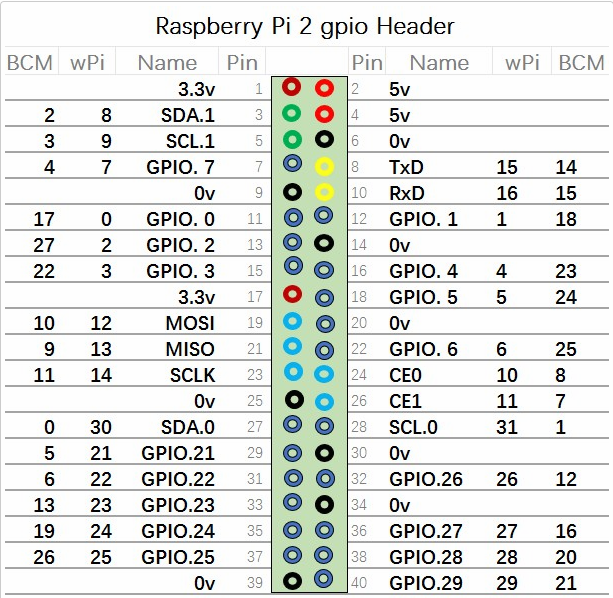
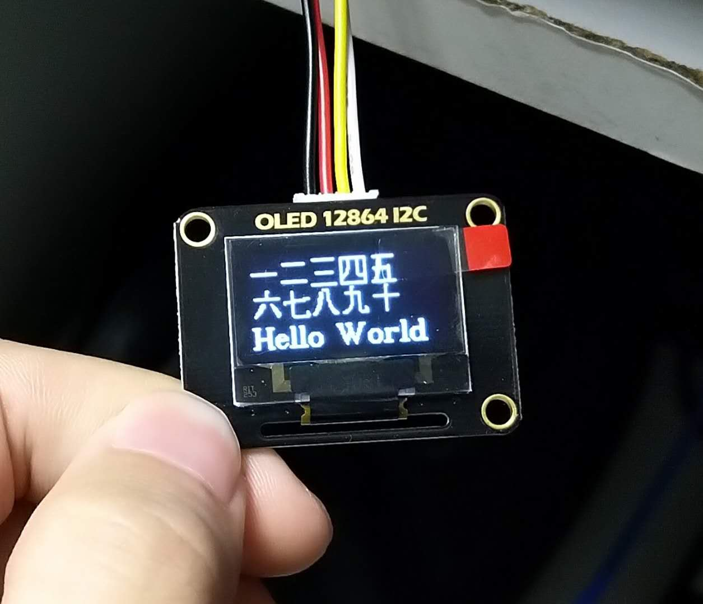

# lumaDemo
一个简单的lumaDemo,在一个通过I2C连接到树莓派的OLED屏上输出几个字符。

## luma安装
见 [luma.examples](https://github.com/rm-hull/luma.examples)  
安装依赖包

    $ sudo usermod -a -G i2c,spi,gpio pi
    $ sudo apt install python-dev python-pip libfreetype6-dev libjpeg-dev build-essential
    $ sudo apt install libsdl-dev libportmidi-dev libsdl-ttf2.0-dev libsdl-mixer1.2-dev libsdl-image1.2-dev

然后下载luma.examples文件夹  

    $ git clone https://github.com/rm-hull/luma.examples.git
    
进入文件夹安装luma组件  

    $ cd luma.examples
    $ sudo -H pip install -e .

## oled屏幕的I2C连接
树莓派                                                OLED    
PIN 1(3V3)           --------------->           VCC    
PIN 3(SDA.1)       --------------->           SDA    
PIN 5(SCL.1)        --------------->           SCL    
PIN 6(0V)              --------------->           GND  

## 输出

## 注意
本Demo基于luma.example中的例子修改简化而成，  
* show_text.py为显示字符的程序
* demo_opt.py是原example中的文件,用于获取屏幕信息
* fonts文件夹中为字体文件，其中code2000.ttf支持中文（似乎支持所有语言的字符）
